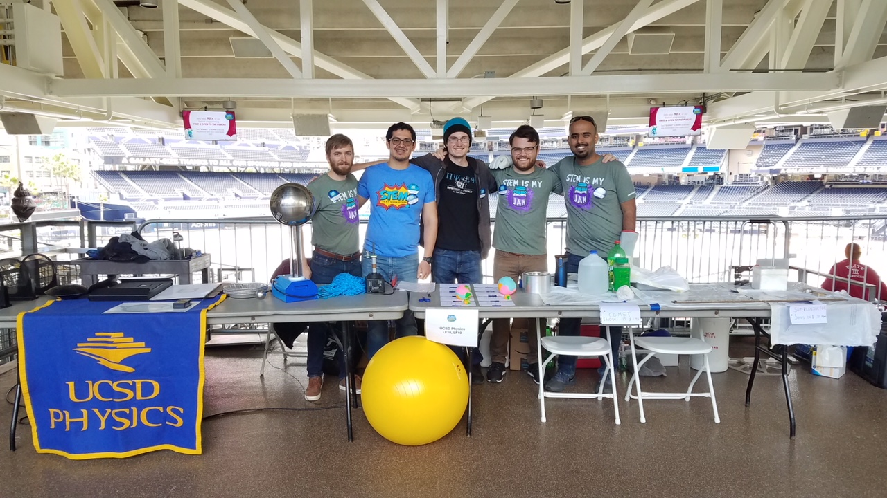
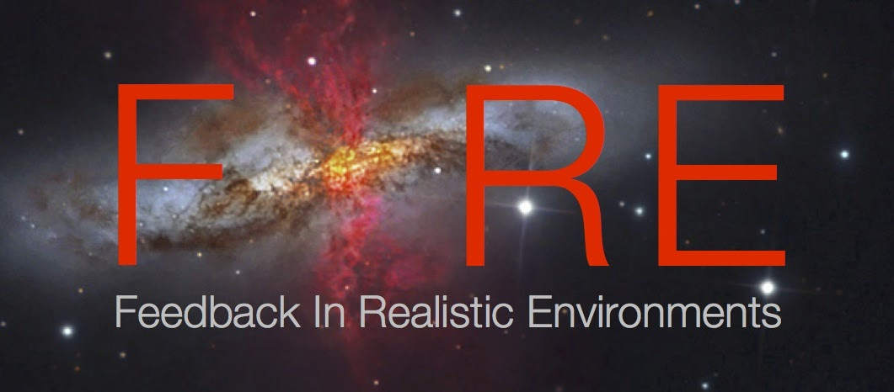
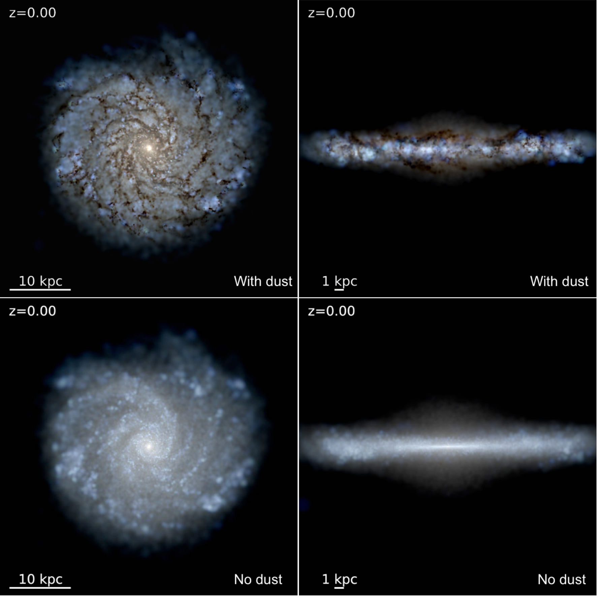
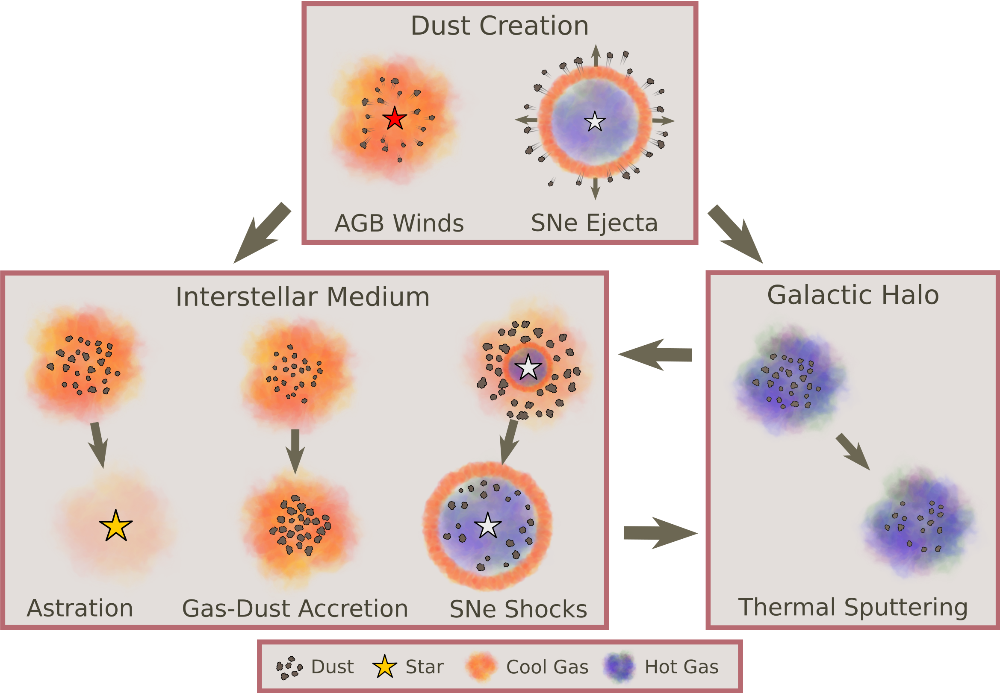

<!--  -->

<h2 class="h1" style="color: {{site.theme_color}}" id="about">Press Kit </h2>

Developer: Trapped Studios
Release Date: October 26th, 2022
Platforms: PC (Steam + itch.io)
Price: $6.99 (demo available at release)
Availability: Digital Download
Languages: English
Press Contact: trapped.dev@gmail.com

<h2 class="h1" style="color: {{site.theme_color}}" >Description </h2>

Artifacts of Eyru is a class based Roguelite first person shooter. Play as 4 classes as you delve into the dungeons of Eyru and claim powerful, game changing artifacts, fight brutally difficult bosses, and do your best to get stupidly overpowered.

<h2 class="h1" style="color: {{site.theme_color}}" > History </h2>

The idea for Artifacts of Eyru was initially developed as a DnD one shot based on Irish mythology. The gameplay was inspired heavily by The Binding of Isaac, especially with respect to the power ups. Development on the game was started at the start of the Covid-19 pandemic by a one-man team with no prior game development experience due to the unexpected influx of free time.

<h2 class="h1" style="color: {{site.theme_color}}" > Features </h2>

  * **Play as one of four classes**, each with three distinct talent trees. You start each run at level 1, allowing you to experiment with different builds.  As the Warlock, you can summon an army of demons, command the souls of your defeated enemies, or unleash a torrent of eldritch tentacles. The Tinker can construct an arsenal of gadgets, perfect the art of assassination, or just keep chucking grenades. With the Wizard, you can conduct experiments in unstable plasma explosions, deadly gravitational forces, or turning enemies into quantum rats. If you like things more straightforward, the Pirate can smack things harder, redirect enemy attacks, or steal even more loot!
  * **Unlock Permanent upgrades** - The various characters in the Hub world can unlock various upgrades for you. Increase the number of keys, potions, and coins you start with, your maximum health, the experience you receive, and much more by spending the Mist you collect from defeating bosses. Purchase new Artifacts to find during runs from the Dust you find from looting power ups. Upgrade and unlock new starting weapons from with the Fae Moss you find hidden throughout levels.
  * **Play as one of four classes** - Each class has 12 unlockable skins, as well as the ability to change the appearance of various key abilities and spells. All cosmetic upgrades are unlockable with in game currencies and there are no microtransactions.
  * **Challenge Modes** – For players who manage to defeat the final boss, there are 100+ customizable challenge options in the vein of Hades’ Heat Levels.  Increase enemy damage, health, or speed; reduce the effectiveness of potions; or give bosses powerful new abilities. Completing challenge modes are required to fully unlock all customizations and starting weapon upgrades.

<h2 class="h1" style="color: {{site.theme_color}}" > Trailer </h2>

<h2 class="h1" style="color: {{site.theme_color}}" > Images </h2>

<h2 class="h1" style="color: {{site.theme_color}}" > Logo & Icon </h2>

<h2 class="h1" style="color: {{site.theme_color}}" > About Trapped Studios </h2>
I am a solo-developer based in San Diego, California. I am primarily a PhD candidate studying Computational Astrophysics. I got into game design both to entertain myself during the Covid-19 pandemic as well as procrastinate working on my research that I should definitely start focusing on more.

<figure>
    
</figure>

Beyond research, I serve as a class representative on the Physics Graduate Council ([PGC](https://sites.google.com/a/physics.ucsd.edu/physics-graduate-council/)) interfacing with department committees and chair to advocate for the graduate population. My recent endeavors include backing an increase in graduate stipends to reduce rent burden and improving work-life balance for first-year students by establishing a flexible teaching workload. During my tenure, I founded a physics mentorship program pairing undergraduate mentees with graduate mentors to provide students guidance on various challenges ranging from graduate school applications to course selection. I am also interested in community outreach, teaching extracurricular labs for local public schools, leading Python coding and research workshops for transfer and local community college students, and running astronomy and physics demonstrations at numerous public science events.

In my spare time I enjoy camping and hiking in national parks, cycling and walking around the beautiful California coastline, and playing a good board game.

{: width="500" height="100" loading="lazy"} 

  <ul>
    <li> <a href="https://www.linkedin.com/in/cchoban" title="LinkedIn" class="no-mark-external" target="_blank">  LinkedIn LinkedIn profile</a></li>
    <li> <a href="https://orcid.org/0000-0001-9200-169X" title="Orcid" class="no-mark-external" target="_blank">  Orcid LinkedIn profile</a></li>
    <li> <a href="https://twitter.com/cchoban" title="Twitter" class="no-mark-external" target="_blank">  Twitter Twitter profile</a></li>
    
  </ul>

[{: width="250" height="100" loading="lazy"}](https://fire.northwestern.edu/)

---
<h2 class="h1" style="color: {{site.theme_color}}" id="research">Research </h2>

<h3 class="h2">Interstellar Dust</h3>

Although it constitutes only 1% of the ISM by mass, dust is integral to the physics within. It provides a surface for astrochemistry such as H2 formation, facilitating the formation of molecular clouds and indirectly stars. It is a key coolant in extremely dense environments, is the primary heat source via the photoelectric effect in neutral phases of the ISM, and can reduce the abundance of important gas coolants which allow gas to cool and collapse. Dust also affects how the ISM reacts to radiation pressure and might help drive galactic winds, which can be crucial for shaping galaxy evolution. Observationally, dust absorbs ultraviolet/optical light and emits in the infrared affecting all astronomical observations to varying degree (check out the image below to see what a Milky Way-like galaxy looks like with and without dust). For instance, the amount of dust and its spatial distribution relative to stars affects the galactic stellar spectral energy distribution (SED) and influences how we interpret observed SEDs.

For a cool animated video explaining dust check out the video below featuring Prof. [Karin Sandstrom](http://karinsandstrom.github.io/), one of my collaborators.

<!-- Put image and youtube video in a table to make them side by side -->
<table><tr>
<td style="width:50%;background:transparent;border:none;" >
</td>
<td style="width:50%;background:transparent;border:none;">
<iframe width="560" height="315" src="https://www.youtube.com/embed/8bRy5VDJsTI" frameborder="0" allow="encrypted-media;" allowfullscreen></iframe></td>
</tr></table>

Interstellar dust also has a complicated life cycle composed of processes during which they can be created, destroyed, grown, or eroded. 

<figure>
    
</figure>

  * **Dust Creation**: The initial seeds' of the dust population are created in the stellar ejecta of SNe and AGB winds where a portion of ejected metals condense into dust. Once these 'seeds' have been created they spend their life in the ISM and/or the galactic halo where they are exposed to various processes. 
  * **Gas-Dust Accretion**: In cool, dense phases of the ISM, gas-phase metals accrete onto the surface of preexisting dust grains growing the grains over time. This is believed to be the main source of dust mass in the MW. 
  * **SNe Shocks**: As supernovae remnants propagate through the ISM they destroy and shatter dust grains residing in the ISM via grain-grain collisions, thermal sputtering, and non-thermal sputtering. This is believed to be the main destroyer of dust in the MW. 
  * **Astration**: As gas cools and collapses forming stars, dust residing in said gas is also destroyed and contributes to the stellar metallicity. 
  * **Thermal Sputtering**: Dust grains residing in hot gas, such as in the galactic halo, are eroded and destroyed by energetic atoms.

<h3 class="h2">Modeling Dust Evolution in Cosmological Zoom-In Simulations</h3>

Observations find diverse dust scaling relations which suggest a complex dust system depending heavily on local gas properties, but many galaxy formation models do not capture this, treating dust in post-processing or assume a constant dust-to-metals ratio (D/Z=0.4). Recent strides have been made developing dust evolution models for galaxy formation simulations but these approaches vary in their assumptions and degree of complexity. Based on these approaches I developed two separate dust evolution models (labelled 'Elemental’ and 'Species’) which include the main mechanisms comprising the dust life cycle mentioned above and incorporated them into the magneto-hydrodynamics GIZMO code coupled to the FIRE-2 model for stellar feedback and ISM physics. The “Elemental” model tracks the evolution of generalized dust species and utilizes a simple, ‘tunable’ dust growth routine, while the “Species” model tracks the evolution of specific dust species with set chemical compositions and incorporates a physically motivated, two-phase dust growth routine. Utilizing idealized Milky Way-like galaxy simulations, I demonstrated that while both models can produce reasonable galaxy-integrated results, the dust by 'Species' approach reproduces the diverse dust scaling relations observed in the MW.

Currently I am investigating how dust evolves over cosmic time utilizing fully cosmological simulations of Milky Way-like and dwarf galaxies and how incoporating 'live' dust evolution and physics in these simulations affects how galaxies evolve.

<!-- <h3 class="h2">Past Projects</h3>
**FILL IN**    
*Advisor: [Adam Burgasser](https://cass.ucsd.edu/index.php/faculty:Aburgasser)*

Description -->

---
<h2 class="h1" style="color: {{site.theme_color}}" id="publications">Publications </h2>

A full list of my publications can be found on ADS [here](https://ui.adsabs.harvard.edu/public-libraries/-Gcrfa83Qq2xs8ndJylF0A).

<!--   
<h3 class="h2">First Author Publications</h3>

<h3 class="h2">Presentations</h3>
 -->
  

---
<h2 class="h1" style="color: {{site.theme_color}}" id="contact">Contact </h2>

Center for Astrophysics and Space Sciences (CASS)   
University of California San Diego   
9500 Gilman Drive   
La Jolla, CA 92093, USA

**cchoba<!-- tyewcnpy -->n [a<!-- juygv -->t] u<!-- tregbijd -->cs<!-- rzyjide --->d [dot] edu**
{:.lead}

